# SINTRA.AI Architecture

> Technical architecture documentation for developers and contributors.

---

## Table of Contents

- [System Overview](#system-overview)
- [High-Level Architecture](#high-level-architecture)
- [Data Flow](#data-flow)
- [Folder Structure](#folder-structure)
- [Core Components](#core-components)
- [Key Concepts](#key-concepts)
- [Database Schema](#database-schema)
- [Deployment Architecture](#deployment-architecture)

---

## System Overview

SINTRA.AI is built on a modern, scalable architecture that separates concerns between the frontend (Next.js), backend API (Express.js), and background job processing (BullMQ workers).

### Technology Stack

| Layer | Technology | Purpose |
|-------|------------|---------|
| Frontend | Next.js 14 (App Router) | Server-side rendering, React UI |
| API Server | Express.js | RESTful API, WebSocket handling |
| Real-time | Socket.IO | Bidirectional event-based communication |
| Queue | BullMQ + Redis | Async job processing |
| Database | PostgreSQL 16 | Primary data store |
| ORM | Drizzle | Type-safe database queries |
| Cache | Redis 7 | Session cache, rate limiting |
| AI | OpenAI GPT-4 | Agent intelligence |

---

## High-Level Architecture

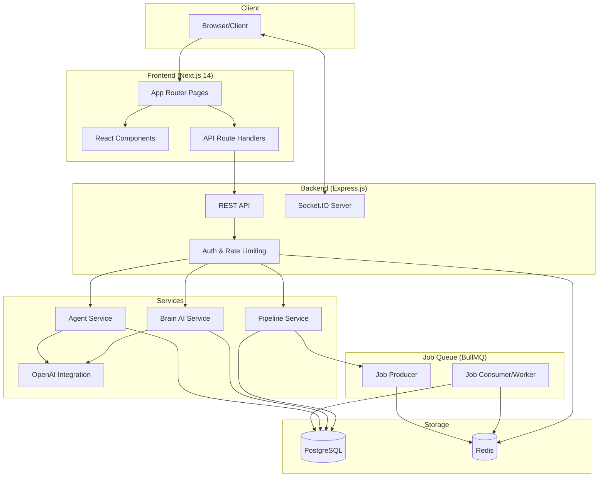

---

## Data Flow

### Request Flow

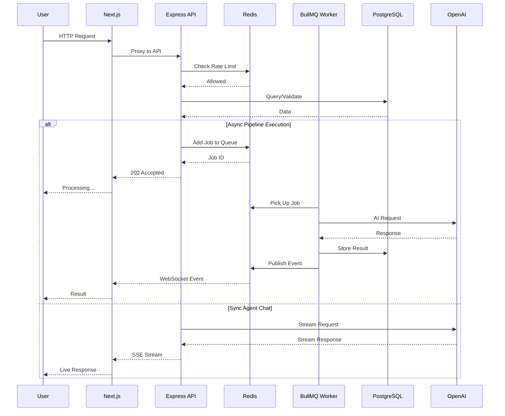

### Agent Chat Flow

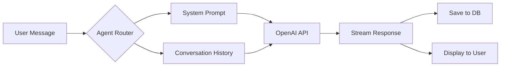

---

## Folder Structure

```
sintra-ai/
├── app/                          # Next.js 14 App Router
│   ├── (app)/                    # Protected routes (authenticated)
│   │   ├── dashboard/            # Main dashboard
│   │   ├── pipelines/            # Pipeline management
│   │   │   ├── page.tsx          # Pipeline list
│   │   │   ├── [id]/             # Individual pipeline
│   │   │   └── studio/           # Visual editor
│   │   ├── agents/               # Agent system
│   │   │   ├── browse/           # Agent catalog
│   │   │   └── [id]/chat/        # Agent chat interface
│   │   ├── brain/                # Brain AI interface
│   │   └── layout.tsx            # Authenticated layout
│   ├── api/                      # Next.js API routes (proxy layer)
│   ├── login/                    # Authentication pages
│   ├── globals.css               # Global styles
│   └── layout.tsx                # Root layout
│
├── components/                   # React components
│   ├── pipelines/                # Pipeline-specific components
│   │   ├── PipelineWizard.tsx    # AI-powered pipeline generator
│   │   ├── VisualEditor.tsx      # React Flow editor
│   │   └── NodeTypes/            # Custom node components
│   ├── agents/                   # Agent chat components
│   │   ├── ChatInterface.tsx     # Chat UI
│   │   └── MessageList.tsx       # Message display
│   ├── brain/                    # Brain AI components
│   └── ui/                       # Shared UI components
│
├── server/                       # Express.js backend
│   ├── index.ts                  # Server entry point
│   ├── routes/                   # API route handlers
│   │   ├── agents.ts             # Agent endpoints
│   │   ├── pipelines.ts          # Pipeline endpoints
│   │   └── brain.ts              # Brain AI endpoints
│   ├── services/                 # Business logic
│   │   ├── AgentService.ts       # Agent orchestration
│   │   ├── PipelineService.ts    # Pipeline execution
│   │   └── BrainService.ts       # RAG implementation
│   ├── middleware/               # Express middleware
│   └── socket.ts                 # Socket.IO configuration
│
├── lib/                          # Shared libraries
│   ├── db/                       # Database layer
│   │   ├── index.ts              # Connection management
│   │   ├── schema.ts             # Drizzle schema
│   │   └── migrations/           # SQL migrations
│   ├── agents/                   # Agent definitions
│   │   ├── personas.ts           # Agent personalities
│   │   └── prompts.ts            # System prompts
│   ├── ai/                       # AI integrations
│   │   ├── openai-service.ts     # OpenAI client
│   │   └── fallback-config.ts    # Fallback handling
│   └── brain/                    # Brain AI system
│       ├── index.ts              # RAG orchestration
│       └── RedisCache.ts         # Caching layer
│
├── workers/                      # Background job processors
│   ├── indexer.ts                # Document indexer
│   └── queues.ts                 # Queue definitions
│
├── docker/                       # Docker configuration
│   ├── docker-compose.yml        # Development stack
│   ├── docker-compose.prod.yml   # Production stack
│   └── nginx/                    # Nginx configuration
│
├── scripts/                      # Utility scripts
│   ├── seed-admin.ts             # Create admin user
│   └── setup-dev.sh              # Development setup
│
├── drizzle/                      # Drizzle ORM
│   └── migrations/               # Generated migrations
│
├── Dockerfile                    # Production Docker image
├── package.json                  # Dependencies
├── tsconfig.json                 # TypeScript config
└── next.config.js                # Next.js config
```

---

## Core Components

### 1. Next.js Frontend

The frontend uses Next.js 14 with the App Router for server-side rendering and client components.

**Key Features:**
- Server Components for initial page loads
- Client Components for interactive elements
- API Routes as a proxy layer to the Express backend
- React Flow for visual pipeline editing

### 2. Express.js Backend

The backend API server handles all business logic, authentication, and real-time communication.

**Key Features:**
- RESTful API design
- JWT-based authentication
- Socket.IO for real-time updates
- Rate limiting with Redis

### 3. BullMQ Workers

Background workers process long-running tasks asynchronously.

**Key Features:**
- Pipeline step execution
- Document indexing for Brain AI
- Email notifications
- Scheduled jobs

### 4. Brain AI (RAG System)

The Brain AI system provides context-aware responses using Retrieval-Augmented Generation.

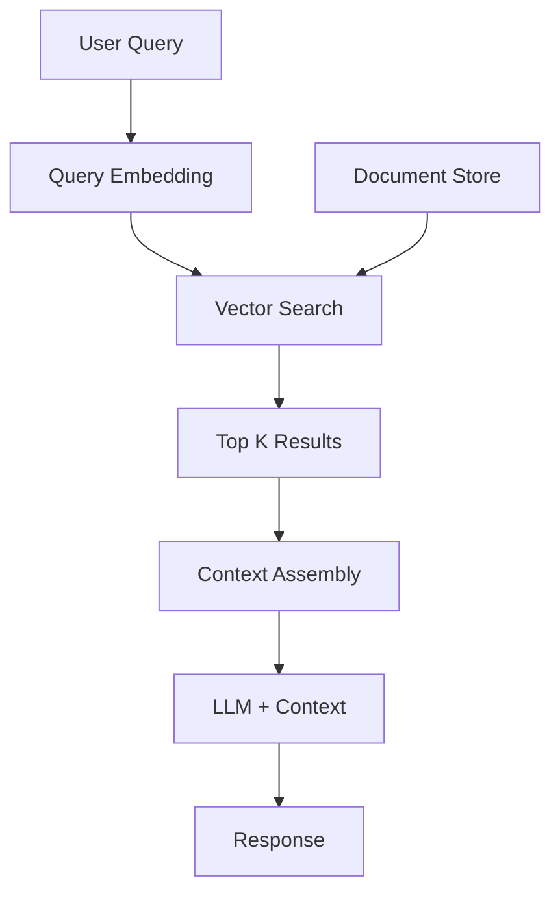

---

## Key Concepts

### Async Execution Engine

The pipeline execution engine uses a producer-consumer pattern with BullMQ for reliable async processing.

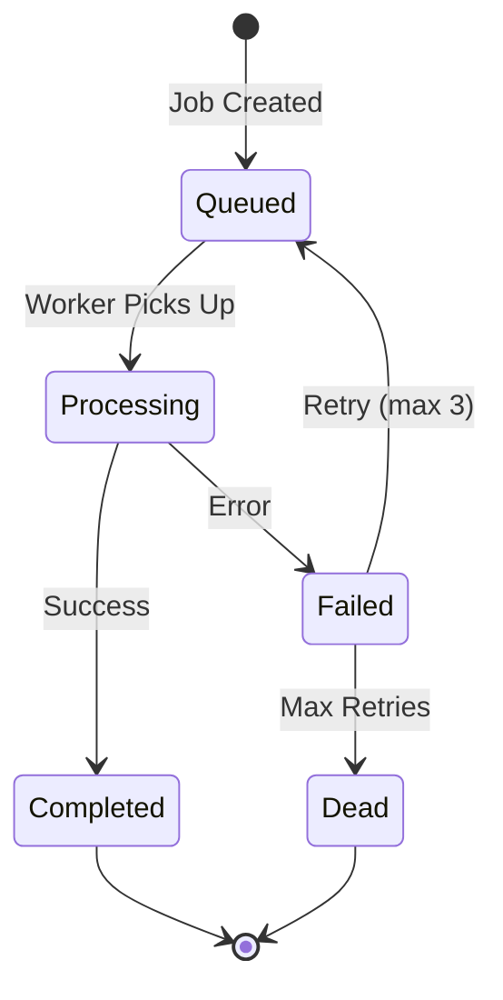

**How it works:**

1. **Job Creation**: When a pipeline is triggered, a job is added to the Redis queue
2. **Worker Processing**: Workers pick up jobs and execute pipeline steps sequentially
3. **Step Execution**: Each step (AI prompt, webhook, database query) runs independently
4. **Error Handling**: Failed steps trigger retries with exponential backoff
5. **Completion**: Results are stored in PostgreSQL and clients notified via WebSocket

**Code Example:**

```typescript
// Producer (API)
await pipelineQueue.add('execute', {
  pipelineId: 'abc123',
  userId: 'user456',
  input: { data: 'example' }
});

// Consumer (Worker)
pipelineQueue.process('execute', async (job) => {
  const { pipelineId, input } = job.data;
  const pipeline = await getPipeline(pipelineId);

  for (const step of pipeline.steps) {
    await executeStep(step, input);
    await job.updateProgress(step.order / pipeline.steps.length * 100);
  }
});
```

### Memory System (Brain AI)

The Brain AI memory system enables context-aware responses by indexing documents and using semantic search.

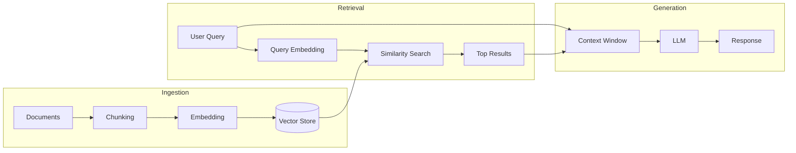

**Components:**

1. **Document Ingestion**
   - Documents split into chunks (~500 tokens)
   - Each chunk embedded using OpenAI embeddings
   - Vectors stored with metadata in PostgreSQL (pgvector)

2. **Semantic Search**
   - User queries converted to embeddings
   - Cosine similarity search against stored vectors
   - Top-K relevant chunks retrieved

3. **Context Assembly**
   - Retrieved chunks assembled into context
   - Token budget managed (max 4000 tokens)
   - Recency and relevance weighted

4. **Response Generation**
   - Context + query sent to GPT-4
   - Agent persona applied
   - Response streamed to client

---

## Database Schema

### Core Tables

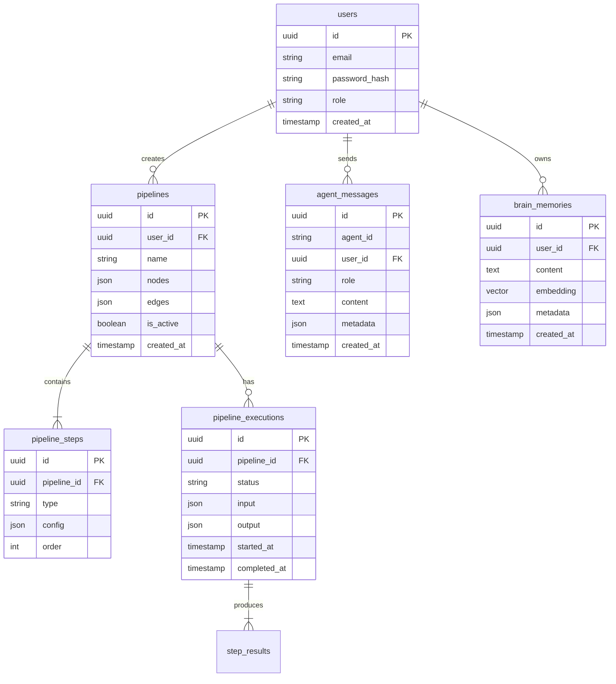

---

## Deployment Architecture

### Production Stack

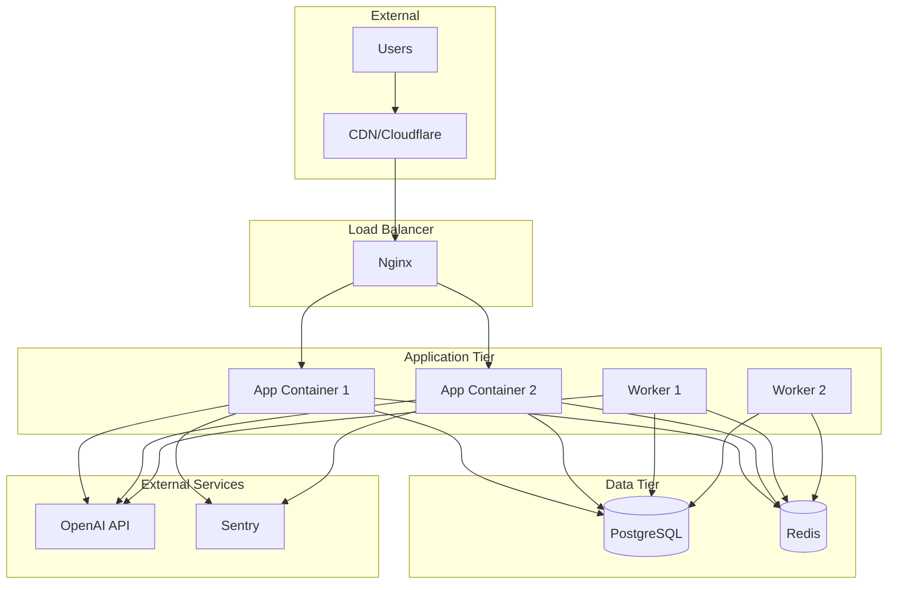

### Container Configuration

| Service | Replicas | Resources | Health Check |
|---------|----------|-----------|--------------|
| nginx | 1 | 256MB | TCP :80 |
| app | 2 | 1GB | HTTP /api/health |
| worker | 2 | 512MB | Redis ping |
| postgres | 1 | 2GB | pg_isready |
| redis | 1 | 512MB | redis-cli ping |

---

## Security Considerations

### Authentication Flow

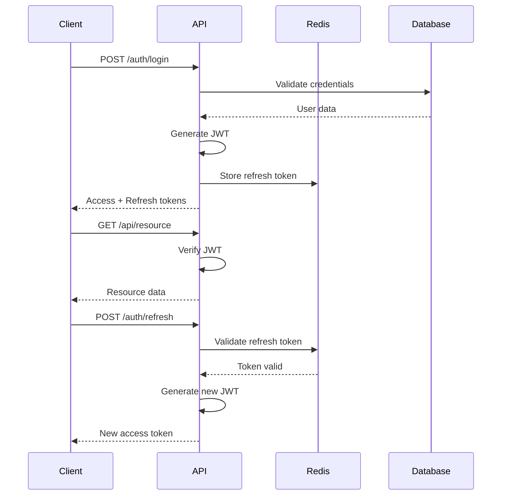

### Security Layers

1. **Transport**: TLS 1.3 everywhere
2. **Authentication**: JWT with short expiry (15min)
3. **Authorization**: Role-based access control
4. **Rate Limiting**: Redis-based per-user limits
5. **Input Validation**: Zod schemas on all endpoints
6. **SQL Injection**: Parameterized queries via Drizzle
7. **XSS Prevention**: React's built-in escaping + CSP headers

---

## Flowent Horizon (Voice Mode Architecture)

### Voice Pipeline Overview

Flowent Horizon provides real-time voice conversations with AI agents using WebSocket binary streaming, speech-to-text, LLM processing, and text-to-speech synthesis.

```mermaid
graph TB
    subgraph Client["Frontend (Browser)"]
        Mic[Microphone] --> AudioCtrl[useAudioController]
        AudioCtrl --> VAD[Voice Activity Detection]
        AudioCtrl --> WS_Client[VoiceSocketService]
        WS_Client --> AudioQueue[AudioQueue]
        AudioQueue --> Speaker[Speaker Output]

        Orb[FluidOrb WebGL] --> AudioCtrl
    end

    subgraph Server["Backend (Express + Socket.IO)"]
        WS_Server[/voice Namespace]
        WS_Server --> STT[OpenAI Whisper STT]
        STT --> LLM[GPT-4 + Agent Prompt]
        LLM --> TTS[OpenAI TTS Streaming]
        LLM --> Artifacts[Artifact Generator]

        WS_Server --> Persistence[VoiceSessionPersistenceService]
        Persistence --> DB[(PostgreSQL)]
    end

    WS_Client <-->|Binary Audio + Events| WS_Server
    TTS -->|Streaming Chunks| WS_Server
    Artifacts -->|agent:artifact| WS_Server
```

### Voice Data Flow (Turn-Based Conversation)

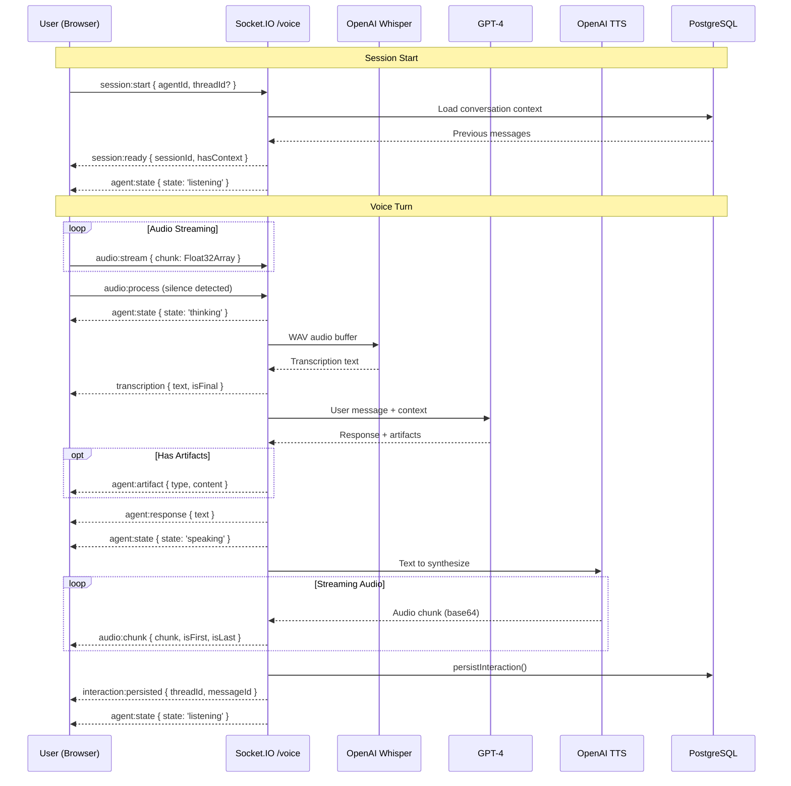

### Barge-In (Interrupt) Flow

Barge-In allows users to interrupt the AI mid-sentence, creating natural conversation dynamics.

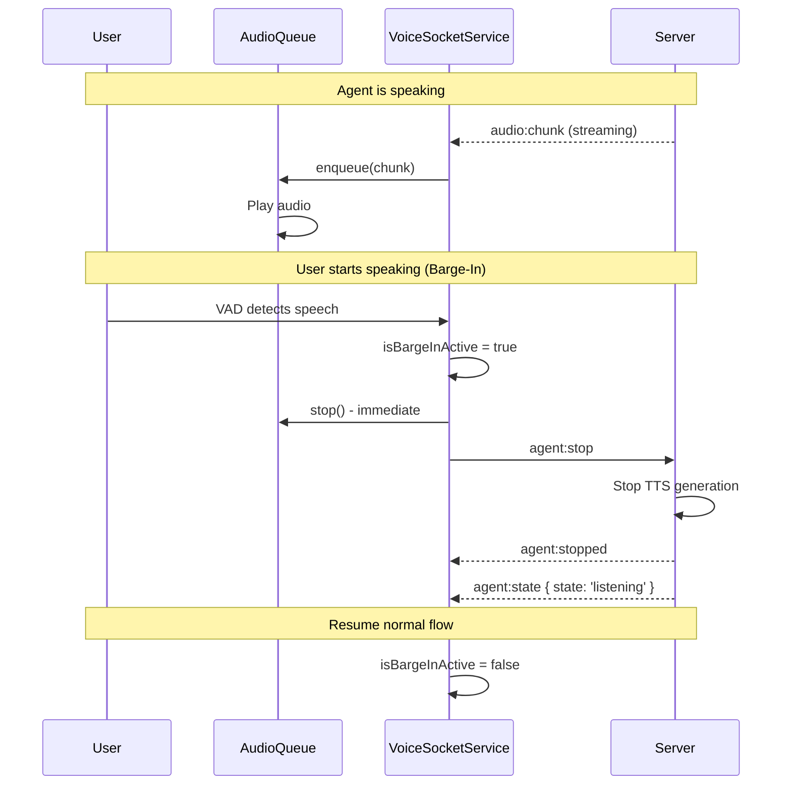

### Voice Session State Machine

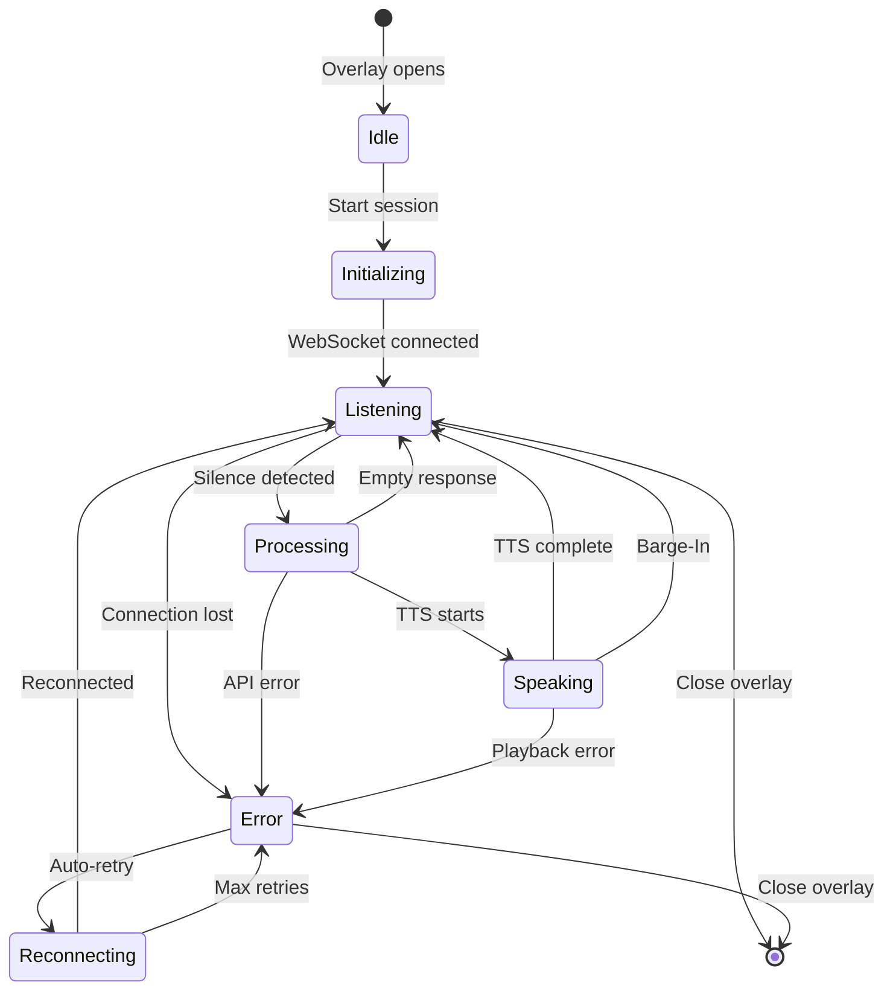

### Reconnection Strategy (Exponential Backoff)

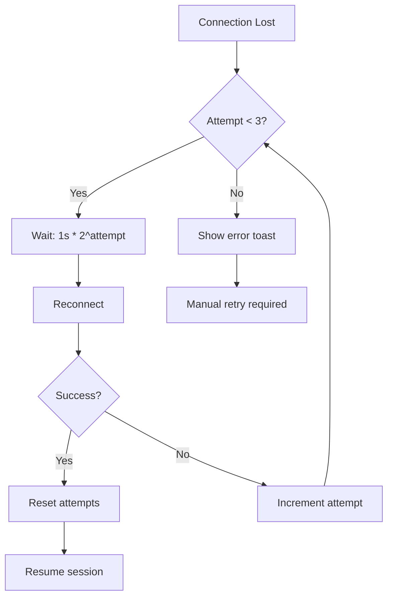

### Audio Processing Pipeline

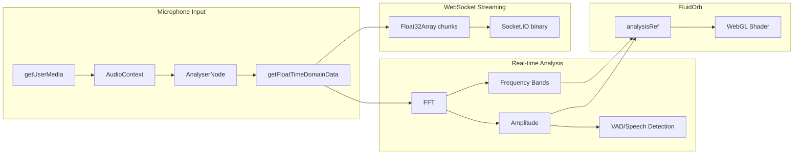

### Database Persistence Model

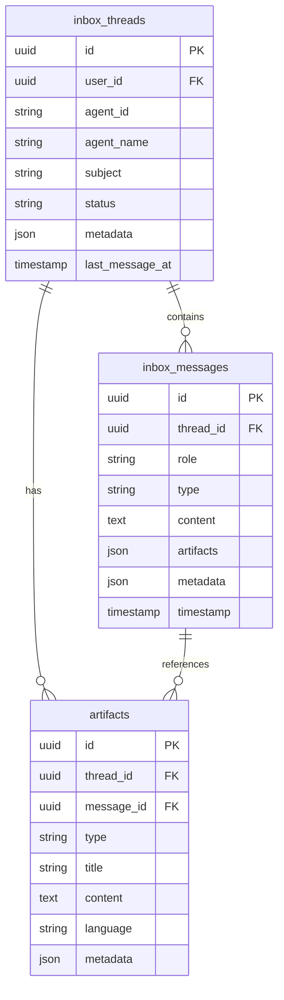

---

## Performance Optimization

### Caching Strategy

| Data Type | Cache Location | TTL | Invalidation |
|-----------|---------------|-----|--------------|
| Session | Redis | 15min | On logout |
| User Profile | Redis | 5min | On update |
| Agent Personas | Memory | 1hr | On deploy |
| Pipeline Results | PostgreSQL | - | Manual |
| Vector Embeddings | PostgreSQL | - | On re-index |

### Database Indexes

```sql
-- Critical indexes for performance
CREATE INDEX idx_messages_user_agent ON agent_messages(user_id, agent_id);
CREATE INDEX idx_pipelines_user ON pipelines(user_id) WHERE deleted_at IS NULL;
CREATE INDEX idx_executions_status ON pipeline_executions(status, created_at DESC);
CREATE INDEX idx_memories_embedding ON brain_memories USING ivfflat (embedding vector_cosine_ops);
```

---

## Contributing

See [CONTRIBUTING.md](CONTRIBUTING.md) for development guidelines and code standards.

---

<div align="center">

**SINTRA.AI Architecture v3.0.0**

</div>
